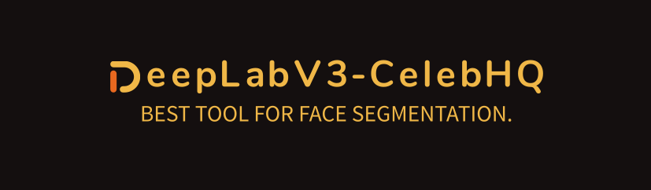

# DeepLabV3-CelebHQ


Trained Torch version of the DeepLab on the CelebHQ. Also dataset used in the model training are [here](https://github.com/switchablenorms/CelebAMask-HQ).

# Requirements
This project requires version of Python of at least 3.10.* Other requirements are listed in the [requirements.txt](./requirements.txt) file. To install all requirements:
```
python3 -m pip install -r requirements.txt
```

# Usage
## Training
Application uses the following CLI for training models:
```
options:
  -h, --help            show this help message and exit
  --data DATA           Path to the dataframe that represents data. More in datasets/README.md
  --output-channels OUTPUT_CHANNELS
  --epochs EPOCHS
  --batch-size BATCH_SIZE
  --tv-split TV_SPLIT   Train-validation split, that defines the size of the train part.
  --mapping MAPPING     Path to the mapping of the layer: index in json format
  -d DEVICE, --device DEVICE
                        The device on which model will train.
```
After starting the training CelebAMask-HQ dataset will be automatically downloaded. If there is any troubles with downloading using gdown you can access it on [Google Drive](https://drive.google.com/file/d/17e_IRjSuise59WUDHVrwZKES71KzJ9bU/view?usp=share_link). For usage you must unzip CelebAMask-HQ.zip into datasets/CelebAMask-HQ folder.

## Evaluation
TBD

# TODO
This list will be updated throughout the time. Contributions are hugely appreciated!

Task name | Progress |
----------|----------|
Implement Tensorboard logging|:white_square_button:|
Implement callback for precision|:white_square_button:|
Implement callback for recall|:white_square_button:|
Implement script for the evaluation|:white_square_button:| 
Train weights and make them public|:white_square_button:|

# Citations
```
@inproceedings{CelebAMask-HQ,
  title={MaskGAN: Towards Diverse and Interactive Facial Image Manipulation},
  author={Lee, Cheng-Han and Liu, Ziwei and Wu, Lingyun and Luo, Ping},
  booktitle={IEEE Conference on Computer Vision and Pattern Recognition (CVPR)},
  year={2020}
}
```